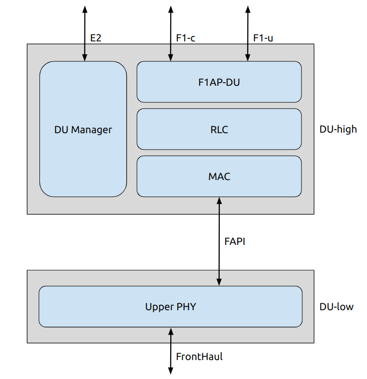

<!--
SPDX-FileCopyrightText: Copyright (C) 2021-2026 Software Radio Systems Limited
SPDX-License-Identifier: BSD-3-Clause-Open-MPI
Portions of this file may implement 3GPP specifications, which may be subject to additional licensing requirements.
-->

# Distributed Unit

[Return to top level architecture diagram](../README.md).

## Components

## Components 

* [DU-high](du_high/README.md)
* [DU-low](du_low/README.md)
